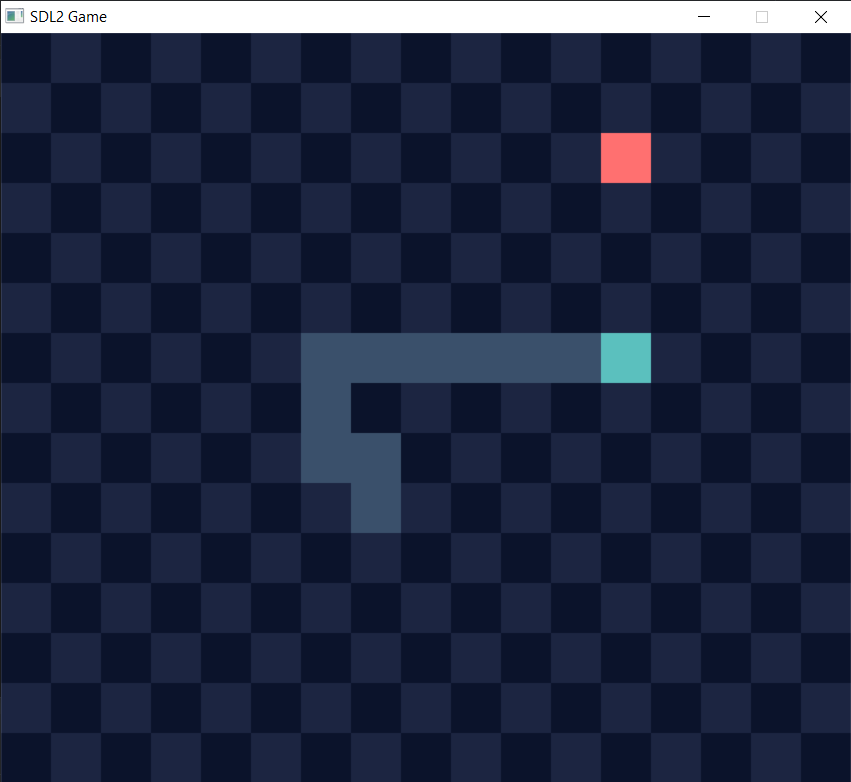

# SDL2 Snake
A snake game clone made with SDL2.\

## Controls
- WASD or Arrow keys to move
## Building & Running SDL2 Snake with CMake
```
mkdir build
cd build
cmake -G Ninja ..   # Using Ninja is optional, you have to install Ninja Build to use it like this case
./sd2project
```